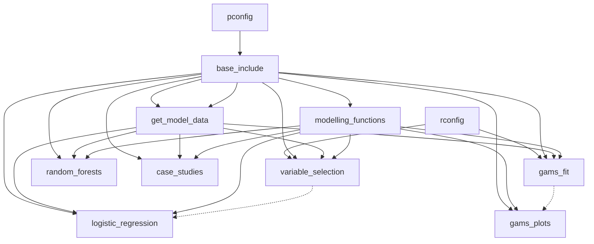

# Code



The solid arrows indicate direct dependencies, i.e. A&rarr;B indicates that file A is called by file B. The dotted arrow from A to B means that file B uses the output from file A, but does not call it explicitly.

## Setup

### Setting home directory on your local machine

To run this repo on your local machine, you will need to set the file path for the home directory in two configuration files--one for Python and one for R. The home directory is the directory on your machine that contains a folder called `vic-ia`, which contains this repo.

For Python, create a file called `code\pconfig.py` and use it to set the global variable `HOME_DIRECTORY` to the home directory for this repo. For example, if the folder `vic-ia` is saved in `C:\Users\me`, then the config file would look like
```Python
from pathlib import Path
HOME_DIRECTORY = Path("C:\\Users") / "me"
```

For R, create a file called `code\rconfig.R` and use it to set the global variable `HOME_DIRECTORY` to same home directory for this repo. For example, if the folder `vic-ia` is saved in `C:\Users\me`, then the config file would look like
```R
HOME_DIRECTORY = file.path("C:" , "Users", "me")
```
The R code in this repo uses the package `reticulate` to read in the modelling code from the Python script `get_model_data.py`. In the R configuration file, set the global variable `PYTHON_EXE_FOR_RETICULATE` to the path to a Python executable. For example, if your Python executable is in a virtual environment in this repo, it could look like
```R
PYTHON_EXE_FOR_RETICULATE = file.path(HOME_DIRECTORY, 'vic-ia', 'venv', 'Scripts', 'python3.exe')
```

### Python version

This code was tested on Python 3.12.1. The packages can be found in `code\requirements.txt`. 

### R version

This code was tested on R version 4.4.1. The packages used are
```
tidyverse 2.0.0
mgcv 1.9.1
glmnet 4.1.8
reticulate 1.40.0
```

## Notebooks
The notebooks are the main place to run code from. The scripts are called by the notebooks.

The 3 types of models are fit in the following notebooks:
- `logistic_regression.ipynb`: linear logistic regression in Python.
- `random_forests.ipynb`: balanced random forests in Python.
- `gams_fit.ipynb`: generalised additive models: fitting the model in R.
- `gams_plots.ipynb`: generalised additive models: creating the paper plots in Python. Run `gams_fit.ipynb` before this notebook.

The case studies are investigated in `case_studies.ipynb`. The variable selection used in the logistic regression model are found in `variable_selection.ipynb` and then hard-coded into `logistic_regression.ipynb`.

## Scripts
These documents contain scripts and functions called by the notebooks.
- `base_include.py`: global variables and file paths.
- `get_model_data.py`: some data cleaning and splitting to prepare it for modelling purposes.
- `modelling_functions.py`: a collection of functions for fitting models and assessing their outputs.


