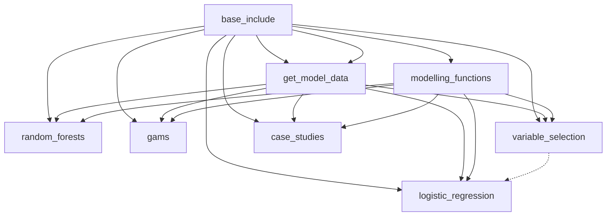

# Code

The solid arrows indicate direct dependencies, i.e. A&rarr;B indicates that file A is called by file B. The dotted arrow from A to B means that file B uses the output from file A, but does not call it explicitly.

## Notebooks
The notebooks are the main place to run code from. The scripts are called by the notebooks.

The 3 types of models are fit in the following notebooks:
- `logistic_regression`: linear logistic regression.
- `random_forests`: balanced random forests.
- `gams`: generalised additive models.

The case studies are investigated in `case_studies`. The variable selection used in the logistic regression model are found in `variable_selection` and then hard-coded into the `logistic_regression` notebook.

## Scripts
These documents contain scripts and functions called by the notebooks.
- `base_include`: global variables and file paths.
- `get_model_data`: some data cleaning and splitting to prepare it for modelling purposes.
- `modelling_functions`: a collection of functions for fitting models and assessing their outputs.

